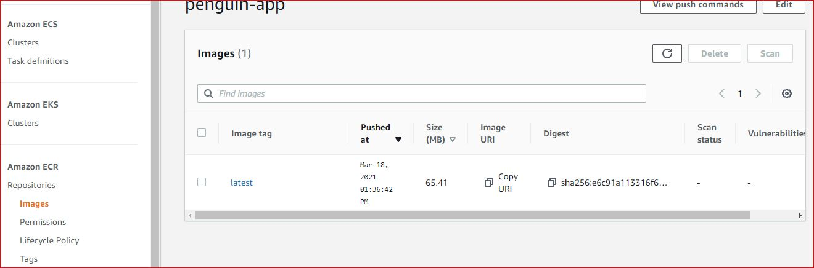
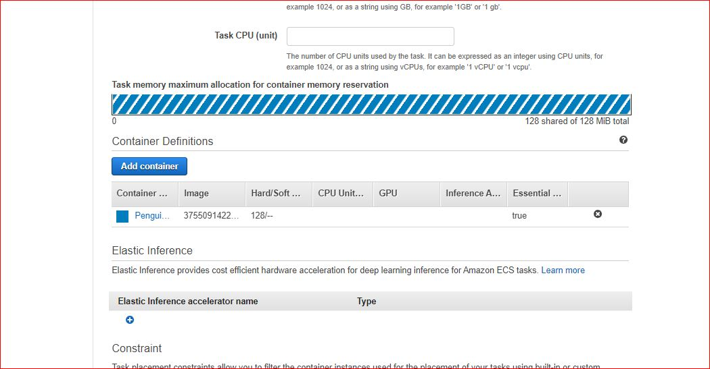
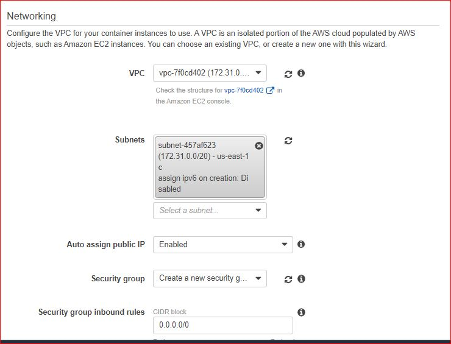
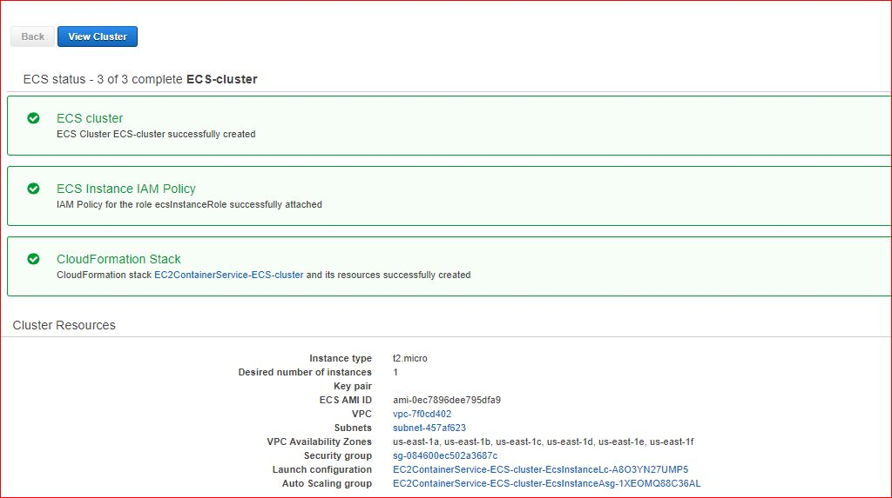

# Deploying a Containerized Flask Application with AWS ECS and Docker #
##  Free Tiers version  ##
Amazon **Elastic Container Service** (ECS) helps schedule and orchestrate containers across a fleet of servers. It involves installing an agent on each container host that takes instructions from the ECS control plane and relays them to the local Docker image on each one.    
We can deploy a  containerized app on Amazon **Elastic Container Service** (Amazon ECS) using **AWS Fargate launch** or **EC2 launch**.   
**AWS Fargate** runs containers without requiring us to deploy or manage the underlying Amazon EC2 instances. This service is **not included in amazon free tier**
In this lab, I will be implementing a solution that will cost us 0$. For that, I will be using the **EC2 launch** and choose **t2.micro** instance type.
  
[Link to the same lab using AWS Fargate](https://acloudguru.com/blog/engineering/deploying-a-containerized-flask-application-with-aws-ecs-and-docker)

## Step 1 – Prerequisites: ##

- AWS Account
- AWS CLI Installed and Configured
- Docker
- Clone this repository

## Step 2 – Build Image ##

    docker build -t flask-app .

### Test image locally ###

    docker run -p 9080:80 flask-app

## Step 3 – Send image up to AWS ##

### Log in to the ECR repository ###

    aws ecr get-login-password --region us-east-1 | docker login --username AWS --password-stdin aws_account_id.dkr.ecr.us-east-1.amazonaws.com 

> Replace `aws_account_id` by your aws account id  
> This will actually **authenticate** you with the **Elastic Container Repository** so you can push the Docker image into it 
  
### Create a repository in AWS ECR   ###
`aws ecr create-repository --repository-name penguin-app` 

### Push image to ECR ###

#### Tag the image by running  ####

    docker tag flask-app:latest aws_account_id.dkr.ecr.us-east-1.amazonaws.com/penguin-app:latest

Replace `aws_account_id` by your aws account id

#### Push the image to AWS ECR   ###

    docker push aws_account_id.dkr.ecr.us-east-1.amazonaws.com/penguin-app:latest

> Replace `aws_account_id` by your AWS account id

## Step 4 – Deploy our web application using ECS ##
### Copy down the URI ###

### Register a task definition ###
- In the Amazon Container Services console, go to the **Amazon ECS** section  
- In the navigation pane, choose **Task Definitions**, Create new Task Definition.  
- On the Select **launch** **type** compatibility page, select **EC2** and choose Next step.  
- Refer to screenshots below to configure remaining steps

### Create a cluster   ###

- In the navigation pane, choose **Clusters**.
- On the Clusters page, choose **Create Cluster**.
- On the Select cluster template page, choose **EC2 Linux + Networking**.
- For Cluster name, choose a **name** for the cluster.
- In the Instance configuration section, do the following:

- For **EC2 instance type**, choose **t2.micro** instance to use for the container instance
- For Number of instances, type **1**
- For **EC2 Ami Id**, use the default value which is the** Amazon Linux 2 Amazon ECS-optimized AMI**. 

  

 
- In the Networking section, for VPC choose either Create a new VPC to have Amazon ECS create a new VPC for the cluster to use, or choose an existing VPC to use.  
		

  
- In the Container instance **IAM role** section, choose Create new role to have Amazon ECS create a new IAM role for the container instances, or choose an existing Amazon ECS container instance (**ecsInstanceRole**) role that you have already created. 
- Choose Create.

### Create a Service   ###
- In the navigation pane, choose **Clusters**.  
- Select the cluster you created in the previous step.
- On the **Services** tab, choose Create.
- In the** Configure service** section, do the following:

	- For **Launch type**, select **EC2**
	- For **Task definition**, select the task definition we created previously.
	- For **Cluster**, select the cluster we created previously.
	- For **Service name**, give a name for the service.
	- For Number of tasks, enter **1**.
	- Use the default values for the rest of the fields and choose Next step.
	- In the Configure **network** section, leave the **default** values and choose Next step.
	- In the Set Auto Scaling section, leave the default value and choose Next step.

- Review the options and choose Create service.
- Choose View service to review the service.
- Confirm that the task is in a **RUNNING** state

### Run the application ###

- In the ECS instances section, expand the** container instance** details where you can see the IPv4 **Public IP** address to use to access the web application.

- Enter the IPv4 Public IP address in the web browser (**http://ip:80**) and you should see the penguin webpage .

## Cleanup ##

- In the Amazon Container Services console, go to the Amazon ECS section 
- In the navigation pane, choose Clusters.  
- Select the cluster we created previously.
- Click **delete cluster**

## Resources: ##
[https://docs.aws.amazon.com/AmazonECR/latest/userguide/getting-started-cli.html](https://docs.aws.amazon.com/AmazonECR/latest/userguide/getting-started-cli.html)  
[https://docs.aws.amazon.com/AmazonECR/latest/userguide/registry_auth.html](https://docs.aws.amazon.com/AmazonECR/latest/userguide/registry_auth.html)
[https://docs.amazonaws.cn/en_us/AmazonECS/latest/developerguide/getting-started-ecs-ec2.html](https://docs.amazonaws.cn/en_us/AmazonECS/latest/developerguide/getting-started-ecs-ec2.html)
